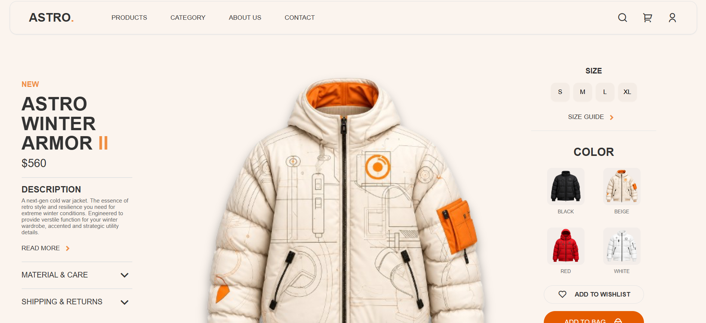
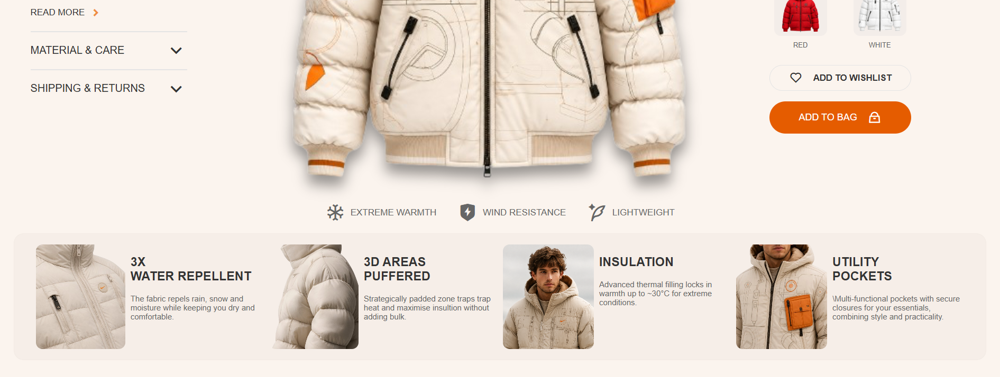

# ASTRO Winter Armor - Product Showcase UI

## Tech Stack

- HTML5
- CSS3
- Remix Icon (CDN)

## Project Structure

```text
CSS Assignment 2/
|-- index.html
|-- index.css
|-- assets/
```

## Screenshot




## Animated Interactions

- Navigation links: hover changes text to orange, adds underline, and increases weight.
- Info links (`READ MORE`, `MATERIAL & CARE`, `SHIPPING & RETURNS`, `SIZE GUIDE`): hover adds orange highlight styling.
- Size buttons (`S`, `M`, `L`, `XL`): hover/focus turns button orange with white text; active state slightly shrinks button.
- Color thumbnails: hover/focus adds orange border and light background highlight.
- Wishlist button: hover turns button orange and icon/text white.
- Add to Bag button: hover darkens orange background.

## How to Run

1. Clone or download the project.
2. Open `index.html` in your browser.
3. (Optional) Use VS Code Live Server for local preview.
